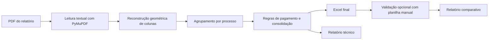

# Precatórios PDF to Excel

<p align="center">
  
</p>

Sistema em Python para extrair dados de relatórios PDF de precatórios, consolidar a saída em Excel e validar o resultado contra uma planilha manual antiga sem expor arquivos sensíveis no repositório.

O projeto foi refatorado para tratar o problema como engenharia de extração estruturada, e não apenas OCR: ele usa a camada textual do PDF, corrige a geometria da página, remove a repetição de cabeçalhos por folha, agrupa corretamente as linhas por processo e aplica regras de negócio de pagamento antes de gerar a planilha final.

## O problema que este projeto resolve

Relatórios desse tipo costumam quebrar extrações simples porque:

- cada página reinicia o cabeçalho da tabela
- algumas células têm múltiplos tipos de pagamento e múltiplos valores
- partes do nome do credor podem “vazar” para a coluna do processo
- a base manual antiga pode conter omissões, nomes divergentes ou diferenças de preenchimento

Este projeto resolve esses pontos e produz:

- uma planilha Excel consolidada
- um relatório técnico de extração
- um comparativo opcional com base manual
- uma interface desktop simples para uso operacional

## Principais habilidades demonstradas

### 1. Parsing estruturado de PDF

- leitura com `PyMuPDF` em vez de depender só de OCR
- correção de rotação e reconstrução geométrica das colunas
- remoção de linhas estruturais e cabeçalhos repetidos
- agrupamento por faixas de processo dentro de cada página

### 2. Regras de negócio aplicadas na extração

- `Pagamento Integral + Cessão - Acordo`: mantém apenas o valor do pagamento integral
- `Pagamento Antecipação + Pagamento Integral + Cessão - Acordo`: soma os dois pagamentos válidos e exclui a cessão
- consolidação de múltiplos pagamentos mantidos em um único registro de saída

### 3. Qualidade de dados e validação

- comparador ponto a ponto entre saída automática e planilha manual
- classificação de diferenças em:
  - match exato
  - mesmo financeiro com nome divergente
  - mesmo processo/credor com valor ou metadado divergente
  - apenas manual
  - apenas automática
- confirmação dos “somente automática” contra o PDF original

### 4. Produto utilizável

- interface desktop com `Tkinter`
- empacotamento em `.exe` com `PyInstaller`
- geração de ícone próprio e branding da aplicação

### 5. Segurança e higiene para publicação

- nenhum PDF real foi versionado
- nenhuma planilha manual ou planilha gerada foi versionada
- pastas de entrada, saída e validação foram protegidas via `.gitignore`
- o bundle legado de OCR foi omitido do repositório por não ser necessário na versão final

## Arquitetura resumida



## Estrutura do repositório

```text
.
├── app_gui.py                  # Interface desktop
├── build_exe.ps1              # Build do executável
├── generate_brand_assets.py   # Geração do ícone do produto
├── leitor_pdf.py              # Núcleo de extração e regras de negócio
├── validar_planilhas.py       # Comparador com base manual
├── requirements.txt
├── assets/
│   ├── extrator_precatorios.ico
│   └── extrator_precatorios.png
└── tests/
    └── test_leitor_pdf.py
```

## Stack e ferramentas

- Python 3.11+
- `PyMuPDF`
- `pandas`
- `openpyxl`
- `Pillow`
- `Tkinter`
- `PyInstaller`
- `unittest`
- `git`

## Como executar

### 1. Instalação

```bash
python -m venv .venv
.venv\Scripts\activate
pip install -r requirements.txt
```

### 2. Extração por linha de comando

```bash
python leitor_pdf.py --input entrada --output saida/precatorios_extraidos.xlsx --report saida/precatorios_validacao.txt
```

### 3. Validação comparativa

```bash
python validar_planilhas.py --manual validação/MinhaBase.xlsx --auto saida/precatorios_extraidos.xlsx --pdf entrada/Relatorio_Precatorios.pdf
```

### 4. Interface desktop

```bash
python app_gui.py
```

### 5. Gerar executável

```powershell
powershell -ExecutionPolicy Bypass -File .\build_exe.ps1
```

## Colunas da planilha de saída

- `Elaborador`
- `Nº do processo`
- `Nº precatorio`
- `Nome do Credor`
- `Entidade/Ente Federado`
- `Data pagamento`
- `Tipo de pagamento`
- `Valor Bruto do Pagamento`
- `Valor líquido pago a parte`
- `NATUREZA`

## Testes

```bash
python -m unittest discover -s tests -v
```

Os testes cobrem regras críticas como:

- identificação de processo com sobra de nome na mesma linha
- extração de múltiplos tipos de pagamento
- descarte correto de cessão
- soma correta de antecipação + integral
- recomposição correta de nomes quebrados entre colunas

## Destaques técnicos para avaliação

Se o objetivo for avaliar a solução como portfólio técnico, os pontos mais relevantes são:

- refatoração de uma abordagem frágil para uma extração baseada em estrutura real do PDF
- implementação de regras de negócio específicas do domínio
- criação de uma rotina de auditoria comparativa para medir qualidade
- transformação do script em ferramenta operacional com interface e executável
- cuidado com privacidade e publicação segura do código

## Sobre dados sigilosos

Este repositório foi preparado para publicação sem incluir:

- PDF original do relatório
- planilhas manuais usadas para conferência
- planilhas geradas pela automação
- relatórios de validação contendo dados reais

Para reproduzir o fluxo completo, basta criar localmente as pastas `entrada`, `saida` e `validação` e colocar seus próprios arquivos.

## Próximos passos naturais

- adicionar logs estruturados
- exportar métricas de qualidade em JSON
- criar instalador do aplicativo
- incluir modo batch para múltiplos PDFs
- adicionar fallback OCR apenas para PDFs sem camada textual
