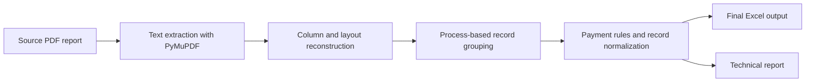

# Precatórios PDF to Excel

<p align="center">
  
</p>

A production-oriented desktop application and Python pipeline for converting Brazilian precatórios payment reports into a clean Excel deliverable, with structured PDF parsing, domain-specific payment rules, and an operational user interface designed for real execution.

## Overview

This project was engineered as a structured document extraction workflow, not as a generic OCR script.

Instead of relying on fragile text scraping, it uses the PDF text layer, reconstructs the table layout from page geometry, removes repeated structural noise, groups entries by legal process, and applies business rules before generating the final spreadsheet.

The result is a tool that is better suited for operational use on real institutional reports, where repeated headers, broken row structures, and mixed payment compositions commonly undermine naive extraction approaches.

## Engineering Highlights

- Structured PDF extraction with `PyMuPDF`
- Geometry-aware column reconstruction
- Process-based record grouping and creditor-name recovery
- Automatic precatório number normalization derived from the process number
- Payment consolidation rules applied before Excel export
- Technical report generated alongside the final spreadsheet
- Branded desktop application with Windows executable packaging

## Processing Flow



## Why This Project Is Non-Trivial

Reports in this domain are difficult to parse consistently because:

- page headers are repeated throughout the file
- single logical rows may contain multiple payment types and amounts
- creditor names can overflow into adjacent columns
- layout artifacts often resemble valid data

This implementation addresses those issues with deterministic parsing logic and business-oriented normalization rules, producing a more trustworthy spreadsheet for downstream operational use.

## Repository Structure

- `app_gui.py`: desktop application
- `leitor_pdf.py`: extraction engine and business logic
- `generate_brand_assets.py`: branded asset generation
- `build_exe.ps1`: Windows build script for the packaged executable
- `assets/`: application icon assets
- `tests/`: automated tests for critical extraction and transformation rules

## Tech Stack

- Python 3.11+
- `PyMuPDF`
- `pandas`
- `openpyxl`
- `Pillow`
- `Tkinter`
- `PyInstaller`
- `unittest`

## Running the Project

### 1. Install dependencies

```bash
python -m venv .venv
.venv\Scripts\activate
pip install -r requirements.txt
```

### 2. Run the extraction pipeline

```bash
python leitor_pdf.py --input entrada --output saida/precatorios_extraidos.xlsx --report saida/precatorios_relatorio_tecnico.txt
```

### 3. Launch the desktop application

```bash
python app_gui.py
```

### 4. Build the Windows executable

```powershell
powershell -ExecutionPolicy Bypass -File .\build_exe.ps1
```

The packaged application is generated at `dist/ExtratorPrecatorios.exe`.

## Output Schema

The generated spreadsheet includes the following columns:

- `Elaborador`
- `Nº do processo`
- `Nº precatorio`
- `Nome do Credor`
- `Entidade/Ente Federado`
- `Data pagamento`
- `Tipo de pagamento`
- `Valor Bruto do Pagamento`
- `Valor líquido pago a parte`
- `NATUREZA`

## Test Coverage

Run the automated test suite with:

```bash
python -m unittest discover -s tests -v
```

Current coverage includes:

- process-id extraction with creditor-name overflow
- payment-type extraction from fragmented text
- cession filtering rules
- anticipation plus full-payment aggregation
- precatório number derivation from the process number
- name reconstruction across broken column segments

## Privacy and Publication

The repository is prepared for public sharing without exposing operational data. Source PDFs, generated spreadsheets, and sensitive runtime directories remain excluded through `.gitignore`.

## Positioning

This repository showcases more than file parsing. It demonstrates how to turn a brittle document-processing problem into a product-quality workflow with domain rules, test coverage, branded delivery, and a desktop experience that is ready for real users.
